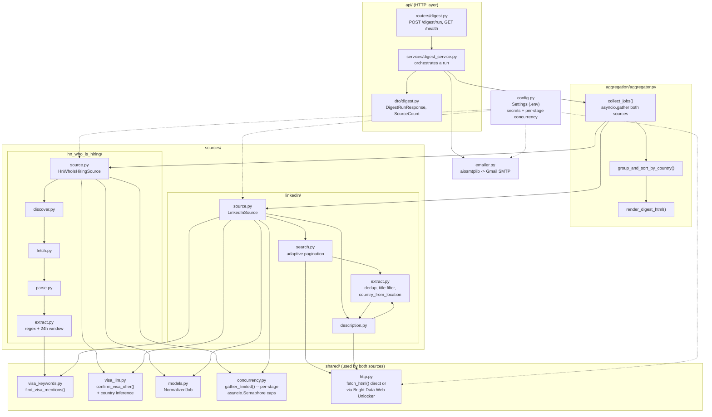
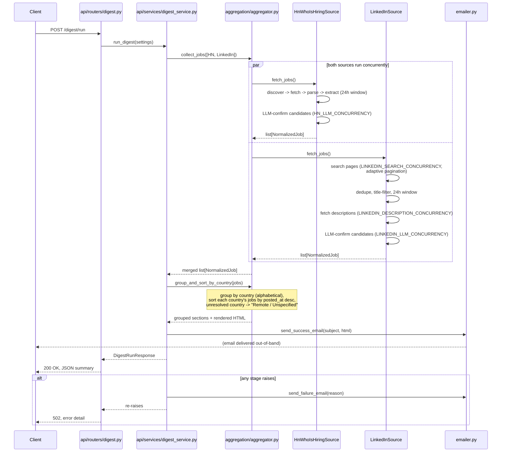

# Architecture

`visa_jobs_api` is a FastAPI service that, on trigger, runs two independent
job-scraping sources concurrently, merges and groups their results, and
emails the combined digest.

## Component diagram

## Request flow (a single `POST /digest/run`)

